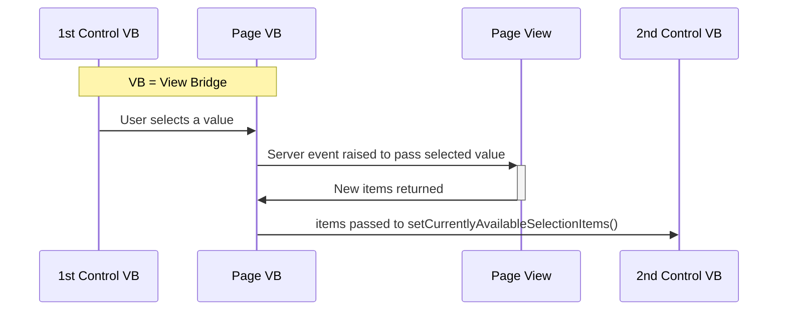
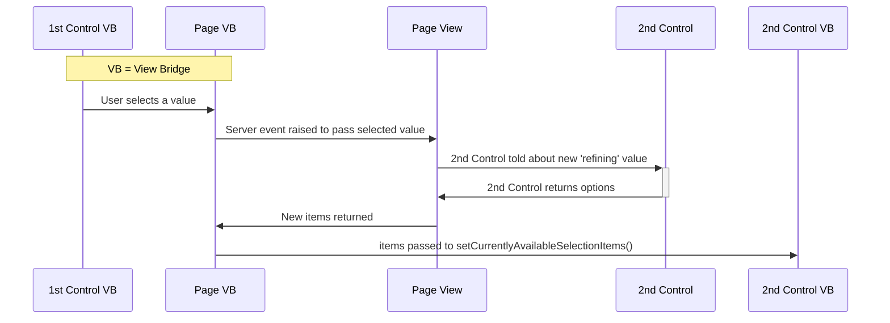
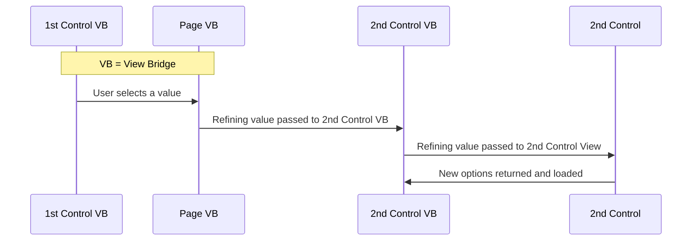

Dynamically Changing Available Items
=====================================

Often the items in a drop down need refined based on interactions with other elements on the page.
For example based on the value selected in one drop down you might want to change the choices in
a second drop down.

To do this we must first learn how to set the possible items in Javascript.

## Changing available items in Javascript

Selection controls have a view bridge method called `setCurrentlyAvailableSelectionItems()`. This
method receives an array of item objects with the familiar structure:

```js
{
    label: 'Item Text',
    value: 'Item Value',
    data: {
        any: 'Other',
        properties: 'At all'
    }
}
```

> Note that some selection controls like the Search Control don't keep a list of items on the
> client side and always return to the server to fetch items. In those cases calling this method
> will have no effect.

## Changing items in response to user interaction

The recommended pattern is to extend the selection control class so that it encapsulates
all the logic around what items are available. Selecton controls have a view bridge
function called `fetchAvailableSelectionItems` to which you can pass any number of arguments
(for example the value of some other element in the UI).

This triggers a server event to recompute the available items, ultimately calling the
`updateAvailableSelectionItems` PHP function with the arguments passed through.
This function needs to be overridden in your selection control class and normally simply
calls `setSelectionItems` with the new configuration of items.

The following demo should help:

``` demo[examples/SelectionControls/DynamicItems.php,DynamicItemsViewBridge.js,DynamicItemsView.php,MenuDropDown.php]
```

### Other approaches

The essence of this problem is that the client must trigger a fetch of new
items and then pass these to the view bridge. A number of solutions present themselves:



The biggest issue with this flow is that the page's View class is responsible for
returning the new items for the second control. However a page is not necessarily
qualified for creating the list of items. To ensure that the option array returned
is exactly as a selection control would have created it, we should make sure that
the selection control itself is responsible for this:



This is however rather convoluted with 5 different actors on stage.

The recommended solution outlined in the demo above is a much more efficient solution:


